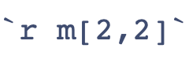

# El YAML para documentos Quarto

**Quarto** es un sistema `open-source`[^1] para publicación científica y técnica. Los documentos cuarto tienen extensión `.qmd` (quarto markdown) y se pueden renderizar a html, pdf, docx y pptx. [Quarto](https://quarto.org). Los documentos mezclan texto en markdown con código.(R, Julia o Python) 

El YAML *Yet Another Markup Language* [yaml](https://en.wikipedia.org/wiki/YAML), de este documento es el encabezado del documento `.qmd` antes de *renderizarlo*[^2]. Estas son las opciones `yaml` del documento, es decir los metadatos[^3] del escrito. Al escribirlo se debe respetar la indentación, se encuentra separado al inicio del documento por tres guiones al comienzo y tres guiones al final. Determina las características del documento. Para saber acerca de YAML más vea [aquí](https://www.ibm.com/es-es/think/topics/yaml).

[^1]: Open source se refiere al software con código fuente que cualquier persona puede inspeccionar, modificar y mejorar. Típicamente desarrollado en forma colaborativa y lanzado bajo licencias que garantizan los derechos de uso, cambio y libre distribución. 

[^2]: render: the process of converting code into viewable, interactive web content

[^3]: datos de los datos

El `yaml` de este documento es:
```         
---
title: El YAML
author: Carlos Lesmes
date: "`r Sys.Date()`"
format:
  html:
    theme: 
      light: flatly
      dark: darkly
    toc: true
    toc_float: true
    number-sections: true
    code-fold: show
    code-tools: true
    code-copy: hover
    code-overflow: wrap
    embed-resources: true
reference-location: margin
lang : es
---
```

Vea más información del YAML en *RStudio* [aquí](https://rpubs.com/gustavomtzv/874870)

::: {.callout-tip}
## OJO
Siempre lea la documentación
:::

## `title`, `author` y `date`

Son respectivamente el título, el autor y la fecha del documento. Dejar un espacio después de los dos puntos y escribir los datos deseados. Las palabras clave `title`, `author` y `date` no se deben cambiar.

## `format`

Aquí se especifíca el formato de salida del documento, en este caso `html`. Dentro de html están algunas de las siguientes opciones:

1.  `theme:` journal
2.  `toc:` true
3.  `toc_float:` true
4.  `number-sections:` true
5.  `code-fold:` show

La opción `theme` permite escoger un color específico para los títulos, enlaces, etc. Puede cambiar el tema `journal` por otros 24 que encontrará en [Temas](https://quarto.org/docs/output-formats/html-themes.html).

## `toc` y `toc-float` 
Muestran respectivamente la tabla de contenido y la mantiene siempre visible con la opción `true`. Si no se desea que lo haga use `false`.

## `number-sections` y opciones para el código

1. `number-sections` enumera los títulos y subtítulos  
2. `code-fold` permite ver y ocultar el código R en el documento haciendo clic en el triángulo-Código.
3. `code-tools` aciva / desactiva todo el código
4. `code-copy` permite copiar el código
5. `code-overflow` maneja la presentación del código cuando tienen muchas líneas

## Escritura de resultados en línea
Dada la matriz m

```{r}
m = matrix(1:16,nrow = 4)
m
```
El elemento (2,2) de la matriz es `r m[2,2]`.

Para obtener el resultado se escribe código r en línea así:




Recuerde que se debe respetar la indentación, es decir, la sangría.

## Documento html autónomo (standalone)

`embed-resources: true` Produce un archivo HTML autónomo sin depencias externas.

## Tema

El siguiente tema agrega al documento la posibilidad de cambiar el fondo de blanco a negro. 

```
---
theme:
  light: flatly
  dark: darkly
---
```

## Advertencias `warnings`

La opción `warning: false` no imprime los warnings generados por `R`. 

## Bibliografía

El archivo de bibliografía que acompaña al documento debe tener el nombre `yaml.bib`, es decir que coincida con el que está declarado en `bibliography` en el yaml. En el archivo `.bib` pegue los items bibliográficos. Por ejemplo, en [google-scholar](https://scholar.google.com) busque el producto (libro, url, artículo,...) vaya a `"cite`, `Bib Tex` y péguelo en el archivo `.bib`. Para saber más de las citas vea [quarto-citation](https://quarto.org/docs/authoring/citations.html)

## Idioma

Por último, para que las opciones salgan en español use `lang: es`. Los tags para ingles, francés y alemán son respectivamente `en`, `fr` y `de`.

## Pies de página y referencia cruzadas

`reference-location: margin` para ver los pies de página en el margen

Para conocer más opciones de html en quarto vea:

[html-options](https://quarto.org/docs/reference/formats/html.html)

Documento *Quarto* realizado con RStudio, vea @allaire2012rstudio y @cookintroduction

## Referencias cruzadas

Vea la gráfica @fig-hist en @sec-plot para aprender a hacer histogramas.

### Gráficas {#sec-plot}

```{r}
#| label: fig-hist
#| fig-cap: "Histograma"

hist(rnorm(500),col = 'steelblue',main="Aletorios normales",xlab = "x",ylab = "frecuencia")
```
Vea @eq-stddev en @sec-equation para entender la desviación estándar.

## Ecuación {#sec-equation}

$$
s = \sqrt{\frac{1}{N-1} \sum_{i=1}^N (x_i - \overline{x})^2}
$$ {#eq-stddev}


## Siguientes pasos

Los documentos **Quarto** se pueden editar en otros editores, vea [otras](https://quarto.org/docs/get-started/authoring/text-editor.html)

## Llamadas `callouts`

Hay cinco tipos de llamadas : 
`note`, `warning`, `important`, `tip`, y `caution`.

::: {.callout-note}
Vea más en [callouts](https://quarto.org/docs/authoring/callouts.html)
:::

::: {.callout-warning}
Estudiar todos los días asegura el dominio del tema
:::

::: {.callout-caution collapse="true"}
## Expand To Learn About Collapse

This is an example of a 'folded' caution callout that can be expanded by the user. You can use `collapse="true"` to collapse it by default or `collapse="false"` to make a collapsible callout that is expanded by default.
:::

::: {.callout-tip}
Siempre hay más, el que busca encuentra...
:::

Vea una hoja de ayuda [aquí](https://rstudio.github.io/cheatsheets/quarto.pdf)

## Shortcodes
Son directivas de markdown para generar otros typos de contenido. Vea más en [shortcuts](https://quarto.org/docs/authoring/shortcodes.html)

Para aprender a hacer **dashboards** en RStudio/Positron vea el siguiente video: 



## Anotaciones al código


```{r}
suppressPackageStartupMessages(library(tidyverse))
suppressPackageStartupMessages(library(palmerpenguins))
penguins |>                                      # <1>
  mutate(                                        # <2>
    bill_ratio = bill_depth_mm / bill_length_mm, # <2>
    bill_area  = bill_depth_mm * bill_length_mm  # <2>
  )                                              # <2>
```
1. Toma el df `penguins`, y luego,
2. agrega dos nuevas columnas


## Markdown

Vea [markdown](https://quarto.org/docs/authoring/markdown-basics.html) para ver lo básico de Markdown.

## Galería de Quarto 

Vea que más puede hacer con Quarto [galería](https://quarto.org/docs/authoring/markdown-basics.html)